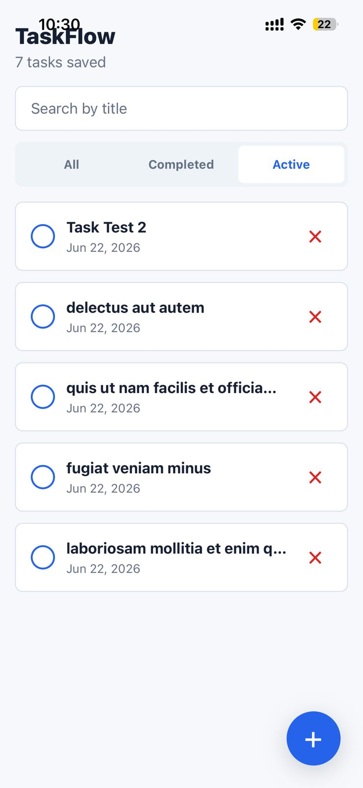
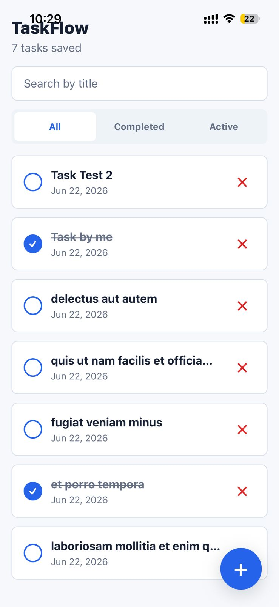
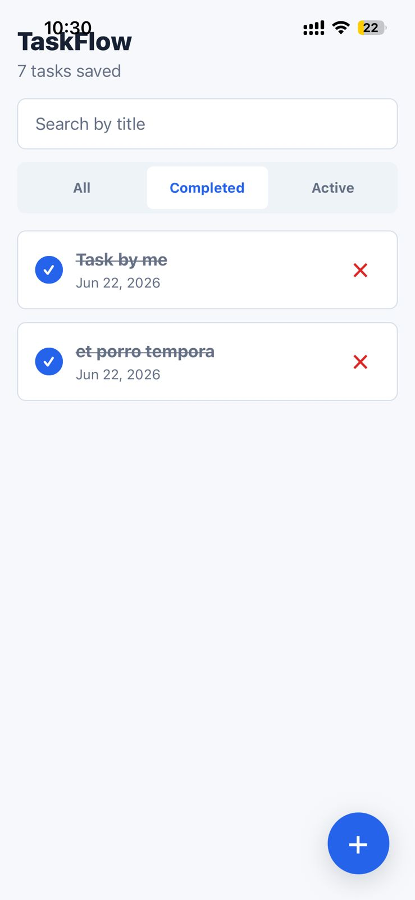
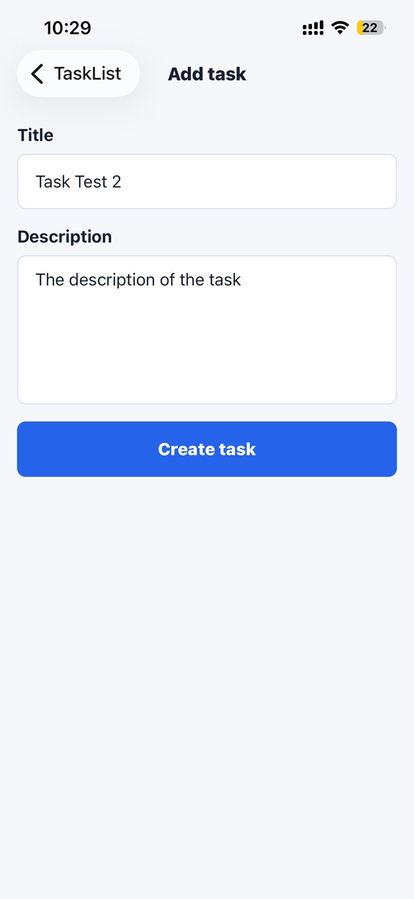
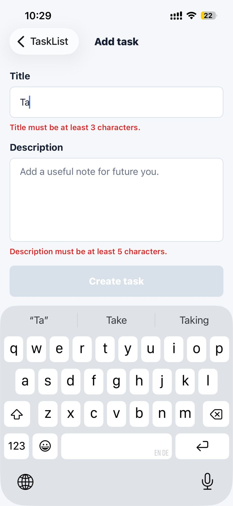
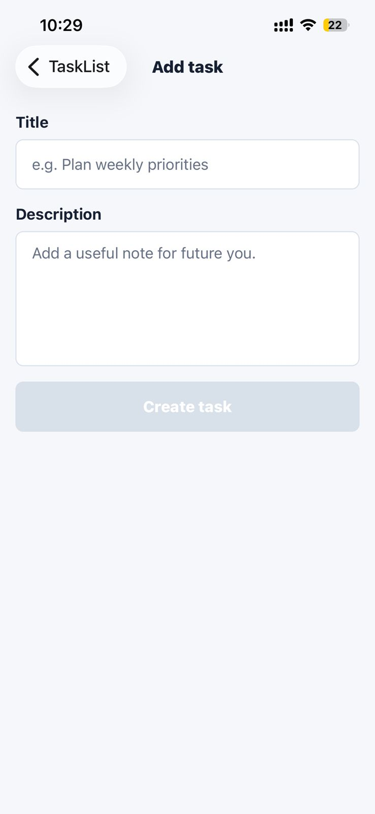
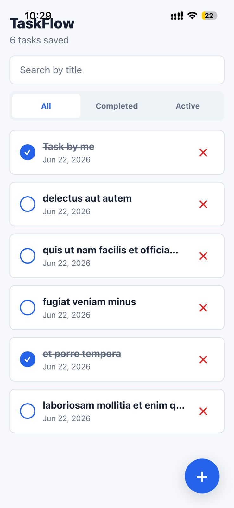

# TaskFlow

TaskFlow is a React Native (Expo) app for managing personal tasks with local persistence, navigation, search, filters, and first-launch demo data.

## What I Built

TaskFlow is a compact, production-style task manager focused on the core flows that matter in a real app: create, edit, complete, search, filter, and delete tasks with local persistence.

- Fast task workflow: add tasks, edit them from details, and toggle completion without leaving the app flow.
- Local-first storage: tasks persist through AsyncStorage, so the app keeps working offline after the first launch.
- Smart list view: search and status filters make it easy to find the right task quickly.
- Clean navigation: a native stack connects the list, details, and edit screens with a simple, review-friendly structure.

## Setup

1. Install dependencies:

   ```bash
   npm install
   ```

2. Start Expo:

   ```bash
   npx expo start
   ```

   If Expo Go on a physical phone cannot connect or says the app is taking too long, start with a tunnel instead:

   ```bash
   npm run start:tunnel
   ```

   For iOS Expo Go connection issues, especially if the phone says the app is taking too long, clear Metro's cache while using the tunnel:

   ```bash
   npm run start:tunnel:clear
   ```

3. Run the app:
   - iOS: press `i` in the Expo terminal, or scan the QR code with Expo Go on iOS.
   - Android: press `a` in the Expo terminal, or scan the QR code with Expo Go on Android.
   - Web: press `w` in the Expo terminal.

   Pressing `a` requires Android Studio, the Android SDK, and `adb` installed locally. If those are not installed, scan the QR code with Expo Go instead.

## Core Features

- Task list: `TaskListScreen` renders tasks with `FlatList`, newest first.
- Task rows: `TaskListItem` shows title, created date, completion toggle, details navigation, and delete action.
- Add and edit task: `AddTaskScreen` validates title and description inline, creates tasks, and edits existing tasks from details.
- Task details: `TaskDetailsScreen` shows the full task, formatted date, status, edit action, toggle action, and confirmation-protected delete.
- Local persistence: all task changes are saved through `services/taskStorage.ts` using AsyncStorage.
- First-launch seed data: `services/seedService.ts` fetches five JSONPlaceholder todos once, maps them into TaskFlow tasks, then records a seeded flag.
- Offline behavior: if the seed request fails, the app starts with an empty list and continues to work locally.
- Search: the list filters by title live as the user types.
- Status filter: `FilterBar` supports All, Completed, and Active views.
- Navigation: React Navigation native stack connects list, add, and details screens.
- Shared UI foundation: `theme.ts` centralizes color, spacing, radius, and typography constants.

## Assignment Coverage

| Requirement                     | Status | Notes                                                      |
| ------------------------------- | ------ | ---------------------------------------------------------- |
| Task list screen                | Done   | Newest tasks first with empty-state handling.              |
| Add new task                    | Done   | Inline validation before saving.                           |
| Mark task complete / incomplete | Done   | Toggle from list or details.                               |
| Delete task                     | Done   | Confirmation-protected deletion.                           |
| Simple task details view        | Done   | Shows title, description, date, and status.                |
| Basic input validation          | Done   | Title and description are validated.                       |
| Clean and simple UI             | Done   | Reusable components and a shared theme keep it consistent. |
| Fetch data from a public API    | Done   | JSONPlaceholder seeds the first launch.                    |
| Functional components and hooks | Done   | Used throughout the app.                                   |
| Reusable components             | Done   | Task rows, search, filter, and empty state are shared.     |
| Empty states                    | Done   | List and missing-task states are handled.                  |
| Search by title                 | Done   | Live search in the task list.                              |
| Filter by status                | Done   | All, completed, and active views.                          |
| Local task storage              | Done   | AsyncStorage persists tasks on device.                     |
| Simple navigation               | Done   | Native stack between list, add/edit, and details.          |

Extra improvement: edit-task support from the details screen.

## Architecture Decisions

- Context plus `useReducer` keeps task state predictable without adding Redux-level complexity to a small app.
- AsyncStorage is wrapped in `taskStorage.ts` so persistence stays typed and isolated from UI components.
- The JSONPlaceholder import is isolated in `seedService.ts` because it is demo bootstrapping, not part of the core task model.
- Reusable components keep screen files focused on orchestration instead of repeated JSX.

## Folder Structure

```text
src/
  components/   Reusable UI such as task rows, empty state, search, and filters
  context/      TaskContext with reducer-backed task state and actions
  navigation/   AppNavigator and root stack route types
  screens/      Task list, add task, and task details screens
  services/     AsyncStorage persistence and JSONPlaceholder seeding
  types/        Task model and filter types
  utils/        Date formatting, validation, and UUID helper
```

## Future Improvements

- Add automated tests for the reducer, validation, and storage layer.
- Improve the first-launch import with richer retry and sync handling.
- Add a more advanced task workflow, such as due dates, priorities, or reminders.

## Screenshots / Screen Recording

The screenshots are stored in `docs/` and embedded here for quick preview.

<table>
   <tr>
      <td align="center">
         
      </td>
      <td align="center">
         
      </td>
   </tr>
   <tr>
      <td align="center">
         
      </td>
      <td align="center">
         
      </td>
   </tr>
   <tr>
      <td align="center">
         
      </td>
      <td align="center">
         
      </td>
   </tr>
</table>

<p align="center">
   
</p>
